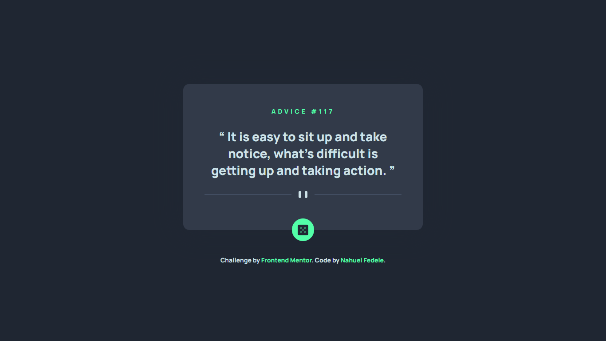

# 🎲 Advice generator app

This is a solution to the [Advice generator app challenge on Frontend Mentor](https://www.frontendmentor.io/challenges/advice-generator-app-QdUG-13db). Frontend Mentor challenges help you improve your coding skills by building realistic projects.

## 📌 Links

- Solution URL: [Github](https://github.com/NahuelEF/advice-generator-app.git)
- Live Site URL: [Github Pages](https://nahuelef.github.io/advice-generator-app/)

## 🎯 The challenge

Users should be able to:

- [x] View the optimal layout for the app depending on their device's screen size
- [x] See hover states for all interactive elements on the page
- [x] Generate a new piece of advice by clicking the dice icon

## 🛠 Built with

- Semantic HTML5 markup
- CSS custom properties
- Flexbox
- Mobile-first workflow
- [Sass](https://sass-lang.com/) - Sass

## 👨‍💻 Author

- Frontend Mentor - [@NahuelEF](https://www.frontendmentor.io/profile/NahuelEF)
